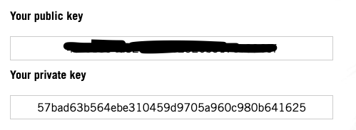

# Marvel API Hash generator

In this project we take need hash to work in Marvel API.

## You need

* [Go to Marvel API Getting Started](https://developer.marvel.com/documentation/getting_started)
* Register in Marvel API.
* Go to **My Develop Account** section: [Link](https://developer.marvel.com/account)
* Take public and private keys

* Create script file and add this content to take hash value and try in Characters Request
```
const getApiHash = require('marvel-api-hash-generator').getApiHash;
const timeStamp = 1;
const privateKey = 'privateKeyValue';
const publicKey = 'publicVale';
const hashValue = getApiHash(timeStamp, privateKey, publicKey);

const requestConstantCharacters = 'https://gateway.marvel.com/v1/public/characters?';
const exampleUrl = `${requestConstantCharacters}ts=${timeStamp}&apikey=${publicKey}&hash=${hashValue}`;
// https://gateway.marvel.com/v1/public/characters?ts=1&apikey=<public-key>&hash=09fe991c34996e64c0424e446f27c9f0
console.log(exampleUrl);
```

## Use Take Hash value and play in interactive documentation

[Link to nteractive documentation](https://developer.marvel.com/docs)